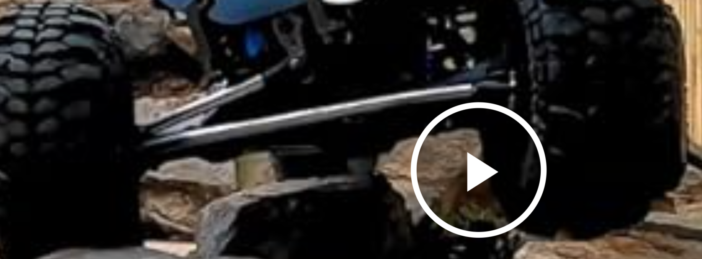

\[  13 Feb 2024 \]
Yesterday, Joel mentioned how a project in the early 2000's used a bunch of ultrasonic sensors + did not have motors but rather did a lot of guiding.

After some research, it was discovered that the ultrasonic sensors was not a great solution, but the whole gliding concept is fantastic since it reduces the development cost of having a heavily opinionated robot while still taking in human input and instead have a very unopinionated robot that changes directions of the wheel to give feedback as to the best direction.

It would work with one servo as such:

