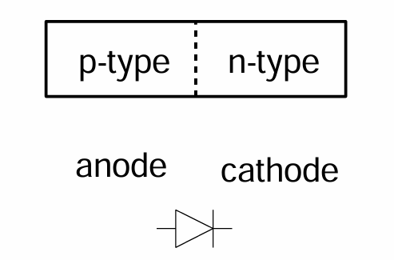
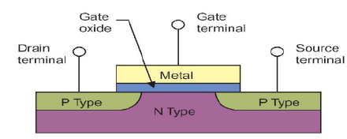

# The Chemistry
## Silicon Lattice
- Transistors are build on a silicon substrate.
- These silicone atoms form crystal lattice with bonds to four neighbors. 

## Dopants
- Silicon is a semiconductor
- Pure silicon has no free carriers and conducts poorly. 
- However, adding dopants increases the conductivity. 
- Group 5 element has an extra electron (n-type). 
- Group 3 element has a missing electron, called hole (p-type).

## p-n Junctions
- A junction between p-type and n-type semiconductor forms a diode.
- Current flows only in one direction.

# nMOS Transistor

## Foundations
- The nMOS transistor has four terminals: gate, source, drain, body
- Gate (oxide) body stack looks like a capacitor
	- Gate and body are conductors
	- $SiO_2$ (oxide) is a very good insulator.
	- Called metal oxide semiconductor (MOS) (even though gate is no longer made by metal)

## Operation
The Body is usually tied to ground (0V)

The theory is that:
**When the gate is at a low voltage:**
- P-type body is at low voltage
- Source-body and drain-body diodes are OFF
- No current flows.
*AKA: the transistor is OFF*

**When the gate is at a high voltage**:
- Positive charge on gate of MOS capacitor
- Negative charge attracted to body
- Inverts a channel under gate to n-type
- Now current can flow through n-type silicon from source through channel to drain.
*AKA: transistor is ON*

# pMOS Transistor

# Foundation

The pMOS transistor is similar to the nMOS transistor, but the doping and voltages are reveresed.

- Body is tied to high voltage ($V_{DD}$)
- Gate low: transistor is ON
- Gate high: transistor is OFF
- Bubble indicates inverted behavior