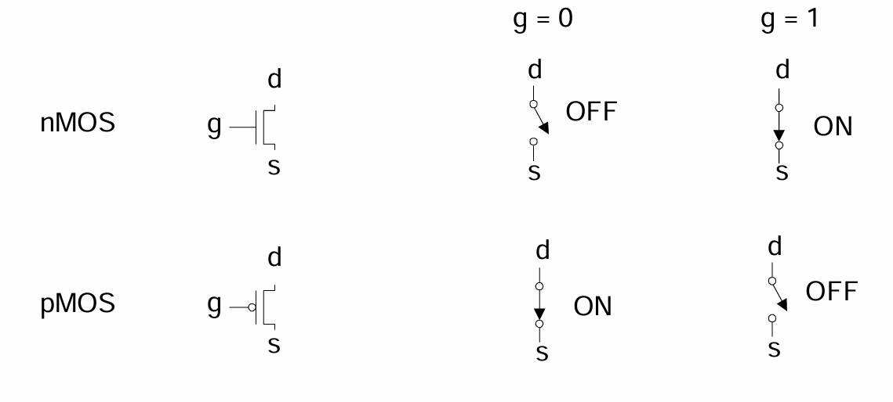

# Power Supply Voltage
GND will always be 0V.
Back in the 80's, $V_{DD}$ = 5V.
However, $V_{DD}$ has decreased in modern processes.
- High $V_{DD}$ would damage modern tiny transistors
- Lower $V_{dd}$ saves power

$V_{DD}$ = 3.3, 2.5, 1.8, 1.5, 1.2, 1.0, . . .

# Transistors as Switches
We can view [[Lecture 00 - Intro#nMOS Transistor|MOS]] transistors as electrically controlled switches. 

Voltage at gate controls path from sources to drain.

# CMOS Transistors
CMOS transistors are used together to create logic gates - the foundation of logic processing.

## CMOS Fabrication

- CMOS transistors are fabricated on silicon wafer
- Lithography process similar to printing press
- On each step, different materials are deposited or etched
- Easiest to understand by viewing both top and cross-section of wafer in a simplified manufacturing process

## Detailed Masks Views:
Six masks (from top to bottom):
- n-well (body)
- thin gate oxide
- polysilicon
- n+ diffusion
- p+ diffusion
- Contacts (to wire together devices if necessary)
- Metal
# Fabrication
- Chips are build in huge factories called fabs
- Contain clean rooms as large as football fields

# Layout
- Chips are specified with a set of masks
- Minimum dimensions of masks determine transistor size (and hence speed, cost, and power)
- Feature size f = distance between source and drain
	- Set by minimum width of polysilicon
- Feature size improves 30% every 3 years or so
- Normalize for feature size when describing design rules
- Express rules in terms of $\lambda$ = fl2
	- E.g. $\lambda = 0.3 \mu m$ in $0.6 \mu m$ process
- Conservative rules get you started in the beginning. 

# Summary
- MOS transistors are stacks of gate, oxide, and silicon.
- Act as electrically controlled switches
- Build logic gates out of switches
- Draw masks to specify layout of transistors