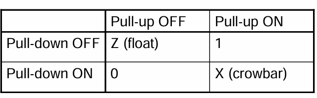
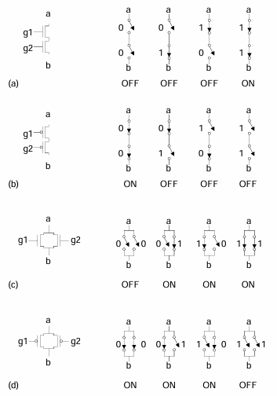

# Transistor Types
**Bipolar transistors**
- npn or pnp silicon structure
- small current into very thin base layer controls large currents between emitter and collector
- base currents limit integration density

**Metal Oxide Semiconductor Field Effect Transistors**
- nMOS and pMOS MOSFETS
- Voltage applied to insulate gate controls current between source and drain
- Low power allows very high integration

# Complementary CMOS

Complementary CMOS logic gates:
- nMOS pull-down network
- pMOS pul-up network
- AKA static CMOS

![Figure01 - Diagram][Assets/Lecture02/Figure01.png]

# Series and Parallel
- nMOS: 1 = ON
- pMOS: 0 = ON
- *Series*: both must be ON
- *Parallel*: either can be ON

# Conduction Complement

Complementary CMOS gates always produce 0 or 1.

For example: NAND gate
- Series nMOS: Y=0 when both inputs are 1
- Thus Y = 1 when either input is 0
- Requires parallel pMOS

Rule of *Conduction Complements*:
- Pull-up network is complement of pull-down
- Parallel $\rightarrow$ series, series $\rightarrow$ parallel

# Compound Gates

Compound gates can do any inverting function

For example: Y = A $\cdot$ B + C $\cdot$ D (AND-AND-OR-INVERT)